# Discord Quest Completer - complete Discord Quests without playing the game

**Finish Discord "play" Quests and collect the Orbs and rewards without downloading, installing, or playing the game.** Type the game's name and Discord sees it as running.

**No .exe to download · no Steam account · no client mod · never runs inside Discord or uses your login · one ~1,350-line PowerShell script you can read before running it.**

<p align="center">
  
</p>

<p align="center">
  <a href="https://github.com/KiarTV/complete-discord-quests/releases/latest"></a>
  
  
  
</p>

## Quick start (Windows, 3 steps)

1. **Accept the Quest in Discord** on Discord's Quests page, and keep Discord
   open.
2. **Open PowerShell** (press <kbd>Win</kbd>, type `powershell`, press Enter) and
   paste:
   ```powershell
   irm https://raw.githubusercontent.com/KiarTV/complete-discord-quests/master/mirror.ps1 | iex
   ```
3. **Type the game's name** from the Quest (for example `roblox` or `apex legends`)
   and press Enter. Leave it running for about 15 minutes, then claim your
   reward in Discord.

Prefer to download something? Grab **[QuestMirror-windows.zip](https://github.com/KiarTV/complete-discord-quests/releases/latest/download/QuestMirror-windows.zip)**,
extract it, and double-click `QuestMirror.cmd`.

### macOS (experimental)

Paste into Terminal:

```bash
curl -fsSL https://raw.githubusercontent.com/KiarTV/complete-discord-quests/master/scripts/install.sh | bash
```

You don't need Homebrew or an admin password. If PowerShell isn't installed, the
script downloads a portable copy once and reuses it after that. macOS support
**hasn't been confirmed against a real Discord Quest yet**. If you try it,
please [open an issue](https://github.com/KiarTV/complete-discord-quests/issues) and say
whether your Quest progress moved.

## How this compares to other ways of completing Quests

There are a few different ways to complete Quests without playing, and each
has trade-offs:

| Approach | What you install | Runs inside Discord / uses your session | Quest types | Breaks when Discord updates |
| --- | --- | --- | --- | --- |
| **Renamed stand-in process (this tool)** | Nothing (one command) | No | Play | Rarely: it doesn't read Discord's internals |
| Renamed stand-in process, desktop app | A downloaded .exe | No | Play | Rarely |
| Console snippet or userscript | Nothing, but you enable Discord's DevTools and paste code | Yes | Most, including video | Can break on any Discord update |
| Client mod plugin (Vencord etc.) | A modified Discord client | Yes | Most, including video | Can break on any Discord update |
| Browser extension | An extension for Discord in the browser | Yes | Mostly video | Can break on any Discord update |

This tool only does **play** Quests. If you need video Quests, one of the
in-client approaches is the only option. If you only need play Quests and
don't want anything touching your Discord client or session, that's what
this is for.

## How to complete a Discord Quest without playing the game

Discord "play" Quests (the "Play *Game* for 15 minutes" kind) only check that
a program with the game's executable name is running on your PC. They don't
check that the game is installed or that you're playing it. This tool:

1. Looks the game up in **Discord's own public list of detectable games** to
   find the exact executable name Discord watches for (e.g. `roblox.exe`).
2. If your spelling doesn't match well, asks Steam's store search for the
   official name (e.g. "gta 5" → "Grand Theft Auto V") and tries again.
3. Copies a harmless built-in system program (`cmd.exe` on Windows,
   `/bin/sleep` on macOS), renames the copy to that executable name, and runs
   it for about 17.5 minutes. Most Quests need 15.

Nothing is downloaded from the game, and the tool doesn't touch your Discord
account, network traffic, or other users. It only changes what your own
Discord client sees running.

## Commands

The prompt (`quest-mirror >`) runs one mirror at a time. If you type another
game while one is running, it's queued and starts automatically when the
current one finishes.

| Command               | What it does                                     |
| --------------------- | ------------------------------------------------ |
| `<game name>`         | start a mirror, or queue it if one's running     |
| `<game name> --pick`  | choose which executable to use (if the first one didn't register) |
| `/status`             | show the running mirror and the queue            |
| `/stop <game name>`   | stop it if running, or cancel it if queued       |
| `/stop all`           | stop the running mirror and clear the queue      |
| `/help`               | show the command list                            |
| `/exit` (or blank)    | quit (the running mirror keeps going)            |

## FAQ

### Does this download or install the game?
No. Nothing from the game is ever downloaded. The "game" is a renamed copy of
a program that's already on your computer.

### Which Quests does it work for?
Quests that ask you to **play** a game for a number of minutes. Video Quests
are a different mechanism, and this tool doesn't do them.

### Can I get banned for this?
There is real risk. Discord has been handing out **Quest access suspensions**
(reported as 14 to 15 days, under the reason *"Inauthentic Quest Completion"*)
to people it believes automated Quests. Nothing stops it from going further.
No method of completing Quests without playing is known to be safe, and that
includes this one.

This tool doesn't modify Discord, run inside it, or talk to Discord's
servers. Your own Discord client sees a running program and reports it the
way it reports any game. But that program is a renamed system executable in
a cache folder, not the real game, and Discord's client can collect details
about the executable it sees. Don't assume that difference is invisible to
Discord.
Only use this on an account you're prepared to have Quest-restricted.

### Discord isn't detecting the game. What now?
- Make sure you **accepted the Quest first** and Discord is running.
- Try `<game name> --pick` and choose a different executable. Some games list
  several.
- If you see *"Process exited immediately after launch,"* your antivirus
  removed the renamed copy. Check Windows Security → Protection history and
  allow the folder it prints.
- Don't run PowerShell as administrator unless you need to. The tool handles
  it, but a normal window is simpler.

### Where are files stored? How do I remove it?
Everything lives in one folder: `%LOCALAPPDATA%\quest-mirror\` on Windows,
`~/Library/Caches/quest-mirror/` on macOS. Delete that folder to remove
everything. Discord's game list is cached there and refreshed every 24 hours.

## Keywords

Discord Quest completer · complete Discord Quests without playing · Discord Quest
without downloading the game · earn Discord Orbs · Discord Quest auto complete ·
fake game activity for Discord Quests · Discord Quest spoofer for Windows and macOS
